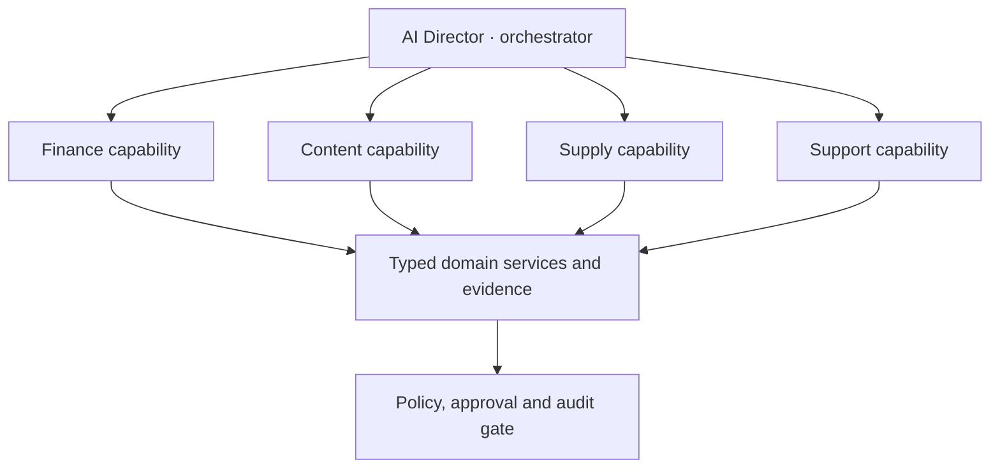

# TROVENDI orchestration and scale architecture

Status: **accepted product architecture; implementation is sequenced through P1–P3**.

This document defines the first paying customer segment, business-model adaptation, self-service onboarding, privacy-safe network insights, scale path and bounded AI specialization.

## 1. First 1,000 users

TROVENDI should not choose between only absolute beginners and large enterprises.

### Core paying segment

The initial core is an owner-led small or medium seller/manufacturer that:

- operates one to five marketplace stores;
- has roughly 20–1,000 active offers and enough transaction history to calculate real economics;
- manages profit, content, advertising and supplies in several disconnected tools or spreadsheets;
- has a founder, commerce lead or finance owner able to approve changes without enterprise procurement;
- needs automation but still wants evidence and control over money-changing actions.

Revenue alone is not the qualification rule. Data availability, operational pain, decision speed and willingness to connect source systems are more useful signals.

### Acquisition segment

Beginner Studio remains the simple acquisition path: one photo, confirmed facts, five grounded cards and a 72-hour trial. Beginners get a guided launch and can grow into the main operating product, but the first commercial proof should not depend only on users who have no sales data or budget.

### Later segment

Large enterprises and agencies follow after SSO/RBAC depth, contractual SLA, audit export, data residency review, connector certification and portfolio controls are production-ready.

## 2. Business operating profiles

This capability is not called multi-tenancy. Multi-tenancy is the security architecture that isolates organizations and stores. Business operating profiles describe how a customer earns money and calculates cost.

One organization can use multiple profiles, and a product may override the organization default.

### Reseller / importer

- Purchase batches in supplier currency.
- FX snapshots at order, payment, customs and receipt dates.
- Product, freight, insurance, broker/customs, duties, domestic delivery and fulfilment landed-cost components.
- Batch-level allocation by units, weight, volume or declared allocation rule.
- Supplier and logistics documents with reconciliation state.

### Manufacturer

- Versioned bill of materials, routing, labour, machine time, scrap, subcontracting, packaging and overhead policy.
- Standard and actual cost remain separate.
- Profit snapshots retain the cost version used.
- Full production planning remains P3 and reuses Integration Hub rather than becoming a second accounting system.

### Distributor / brand operator

- Supplier price lists, rebate/bonus terms and contract period.
- Recommended-price and promotional-policy monitoring where the data source and legal use are verified.
- Competitor price signals carry provenance and confidence.
- Price changes remain bounded proposals unless an approved executor and legal policy permit automation.

### Hybrid

A store may resell some SKUs, manufacture others and distribute a brand line. The model therefore belongs at organization default plus product/cost-source override, not as a permanent account label.

Core schema:

- `business_profiles`, `business_profile_versions`, `product_business_profiles`.
- `cost_model_versions`, `cost_components`, `cost_allocation_rules`.
- `purchase_batches`, `landed_cost_lines`, `supplier_price_versions`.
- `pricing_policy_versions`, `pricing_policy_assignments`, `competitor_price_observations`.

## 3. Self-service onboarding

The onboarding promise is `connect safely -> see data completeness -> confirm business facts -> receive first useful decision`.

### Flow

1. Create account and workspace.
2. Connect a marketplace through a server-side credential flow. Raw credentials never enter an LLM prompt.
3. Test the connection read-only and display exact granted/missing capabilities.
4. Import catalog, stock, orders/sales and finance sources through resumable jobs.
5. Infer candidate business profiles from observable evidence and answers. Show confidence and reasons.
6. User confirms or corrects profile, cost source, tax assumptions, warehouses and goals.
7. Run completeness and reconciliation checks.
8. Build a dashboard from confirmed modules; unavailable metrics stay visibly incomplete.
9. Deliver the first value: real profit completeness plus the top three evidence-backed actions.

The system may personalize onboarding but cannot silently decide accounting truth. A detected profile is a proposal until confirmed.

### Activation metrics

- successful read-only marketplace connection;
- first complete catalog/stock sync;
- percentage of sales covered by finance data and confirmed costs;
- first grounded card or first evidence-backed Director recommendation;
- time to first trustworthy value, not time to a decorative dashboard.

Core schema:

- `onboarding_sessions`, `onboarding_steps`, `connection_capability_checks`.
- `profile_inference_runs`, `profile_confirmations`, `data_completeness_checks`.
- `activation_events`, `onboarding_blockers`.

## 4. Privacy-safe network insights

Cross-customer insights are a later product, not a free by-product of having customer data.

### Rules

- Separate consent is required for service operation, product improvement and anonymized benchmarking.
- Raw tenant records, prompts, embeddings and per-store metrics never enter another tenant's retrieval context.
- Marketplace contracts and data-use rights must permit each aggregate use case.
- Cohorts use comparable category, price band, fulfilment model, geography and period.
- Minimum cohort size, dominance checks, outlier suppression and query-rate controls prevent reverse identification.
- Add statistical noise or differential-privacy techniques where appropriate; disclose method, sample and uncertainty.
- No customer is labelled a competitor or exposed as a `top seller` to another customer.

### Benchmarking

Show the seller's own verified metric against an eligible cohort distribution: median, quartiles, sample size band and period. Do not present a single unexplained average or make a causal recommendation from correlation alone.

### Logistics radar

Aggregate permitted acceptance and delay events into a warehouse/route health signal. Director combines that signal with the seller's own stock, tariff, route and capacity before recommending a destination. The radar never exposes which connected seller reported an event.

Core schema:

- `data_use_consents`, `benchmark_metric_definitions`, `benchmark_cohort_versions`.
- `benchmark_aggregate_snapshots`, `privacy_budget_events`, `aggregate_access_audit`.
- `logistics_signal_events`, `logistics_radar_snapshots`, `radar_confidence_inputs`.

## 5. Scale path

One thousand customers do not automatically require Kafka or many microservices. Premature distribution creates consistency, operations and cost problems.

### Near-term architecture

- Keep clear domain modules in the existing application and PostgreSQL.
- Use tenant-scoped queries, explicit service contracts and database migrations.
- Add transactional outbox/inbox records so a database change and its event cannot diverge.
- Route long-running synchronization and AI work through a durable queue with idempotent jobs, retry policy, dead-letter handling and replay.
- Schedule marketplace calls through per-token, endpoint and marketplace rate-limit budgets with jitter and backpressure.
- Separate worker pools by workload: marketplace I/O, finance reconciliation, AI generation and notifications.
- Measure queue age, provider latency, rate-limit saturation, retries, duplicate suppression and database load.

### Extraction triggers

A domain becomes a separate service only when measured load, release ownership, security isolation or availability requirements justify it. Kafka or a streaming log becomes a candidate when TROVENDI needs high sustained event throughput, multiple independent consumers, long replay history and database outbox relay is a measured bottleneck.

ClickHouse or another analytical store becomes a candidate for large append-only event analytics; PostgreSQL remains the transactional source of truth. Technology is selected from workload evidence, not user-count slogans.

## 6. Bounded AI specialization

TROVENDI uses a logical network of specialized AI capabilities, not a group of unrestricted bots with direct production access.

### Roles

- `Director`: constructs and tracks a plan, chooses an allowlisted capability and combines results.
- `Finance`: explains typed Profit Center results and scenarios. It cannot write or execute arbitrary SQL.
- `Content`: produces grounded text/image drafts from the immutable fact set and marketplace profile.
- `Supply`: consumes forecasts, stock and route services and proposes supply plans.
- `Support`: answers from versioned knowledge and escalates incidents; it has no Director write permissions.
- Future advertising, reputation and production capabilities follow the same contract.

### Shared state

Shared memory is structured, scoped state:

- PostgreSQL for business facts, plans, decisions, policies and audit;
- object storage for source documents and generated assets;
- event/outbox records for state changes and replay;
- vector/lexical index only for unstructured knowledge retrieval.

A vector database is not the source of financial truth and is not used as a permission system.

### Capability contract

Every AI capability declares:

- input/output schema and version;
- required evidence and freshness;
- allowed tools and maximum cost/time;
- read/write risk class;
- required actor permission and confirmation;
- idempotency, audit and verification behavior;
- failure and fallback response.

The coordinator cannot invent a new tool call or bypass a domain policy. Deterministic services calculate money, eligibility, stock and limits.

## 7. UX modes

### Guided mode

For beginners, Director reduces complexity to one next step and prepares drafts. It never promises `вывести товар в топ`, guaranteed sales or profit. External writes still follow the same policy and confirmation gates.

### Expert mode

For experienced sellers, Director exposes evidence, alternative scenarios, assumptions and diffs. Users can define bounded policies, roles and approval thresholds.

These are presentation and permission-policy modes over one platform. They are not separate agent implementations and do not weaken financial safeguards for beginners.

## 8. Delivery order

### P1

1. Business-profile proposal and confirmation in self-service onboarding.
2. Data-completeness gate and first trustworthy value screen.
3. Typed capability registry for Director; no arbitrary SQL or tools.
4. Transactional job/outbox foundation and observable rate-limit scheduling.

### P2

1. Importer landed-cost batches and basic manufacturer cost versions through Integration Hub.
2. Workload-specific worker pools and replay/dead-letter operations.
3. Agency/enterprise onboarding controls.

### P3

1. Production costing/planning and distributor price-policy workflows.
2. Privacy-safe benchmark pilot only after consent and cohort thresholds are viable.
3. Logistics radar pilot only after contractual data-use review.
4. Extract services or add streaming infrastructure only for measured bottlenecks.

## 9. Decisions explicitly rejected

- Calling business-model selection `multi-tenancy`.
- Letting AI silently select tax, cost or accounting truth.
- Giving a Finance Agent direct arbitrary SQL access to production.
- Using a vector database as shared transactional memory.
- Adopting Kafka/microservices solely because the product targets 1,000 users.
- Sharing or benchmarking customer data without separate consent and disclosure protection.
- Giving beginners a weaker safety policy or promising automatic ranking growth.

