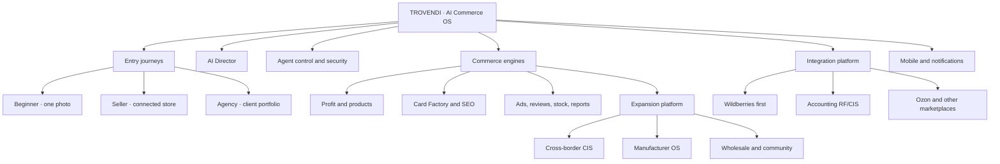
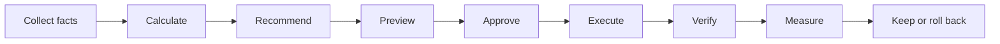

# TROVENDI product tree

Status legend: **live foundation** = real data/code exists; **active** = current production work; **planned** = sequenced but not implemented.

## 1. Entry journeys

- **Beginner — live foundation:** photo analysis → confirmed facts → card draft → economics → preview → approved publication → hand-off to AI Director. Trial: 72 hours from first successful analysis, five successful cards, one user, one store.
- **Existing seller — live foundation:** connect store → catalog/stocks/sales snapshots → Profit Center → evidence-ranked Daily Director → Card Factory or operational action.
- **Agency — planned:** organizations → clients → stores → roles → approvals → portfolio reporting → white label.

## 2. Core operating loop

AI coordinates the loop. Deterministic services remain authoritative for facts, money, permissions, limits, audit and external writes.

## 3. Module branches

| Branch | Status | Depends on | Next gate |
| --- | --- | --- | --- |
| Accounts, stores, trial | **live foundation** | PostgreSQL, auth, server entitlements | RF/CIS payment checkout and verified webhook adapter |
| Business profiles / onboarding | **live foundation** | store context + source health + durable jobs | Source-specific mapping UI and document readers |
| WB snapshots | **live foundation** | encrypted token, worker | Reconciliation and freshness SLO |
| Products | **live foundation** | catalog + stock + velocity | Provenance and cross-source identity |
| AI Card Factory | **live foundation** | facts + AI persistence | Production observation of text and media writes |
| Beginner Studio | **active** | trial + facts + Card Factory | Reuse stored visuals and publication pipeline |
| Profit Center | **live foundation** | WB ledgers, verified costs, guided CSV mapping and store presets, preview/commit + tax | Production reconciliation, XLSX and certified accounting adapters |
| AI Director | **live foundation** | healthy sources + Profit Center | Previewed marketplace-write executors and verified rollback |
| Agent network and Security Sentinel | **live foundation** | auth + store scope + audit | Offline eval artefacts, signed policy promotion and bounded executor gates |
| AI Support Agent | **planned P1** | audit, store context + versioned knowledge | Incident intake and deterministic escalation first |
| SEO, advertising, reviews | **planned P1** | Director + marketplace readers | Read-only insight before writes |
| Reports and autopilot | **planned P1/P2** | audit + approvals + measurement | Bounded policies and rollback evidence |
| Integration Hub | **planned P2** | canonical commerce model | 1C and MoySklad first |
| Android/PWA | **foundation** | versioned API + event model | Alerts, camera, approve/reject, emergency stop |
| Cross-border CIS | **discovery** | Integration Hub + reconciled Profit Center | Kazakhstan read-only economics pilot |
| Manufacturer OS | **planned P3** | canonical products + accounting sources | Versioned BOM and production costing |
| Omnichannel / Wholesale | **planned P3** | inventory ledger + channel connectors | Reservation-safe stock and quote MVP |
| Professional community | **planned P4** | active verified users + moderation | Guides, verified profiles and partnership requests |
| Network insights | **planned P3** | consent + viable protected cohorts | Benchmark and logistics-radar pilots |

## 4. Integration tree

- Marketplaces
  - Wildberries: catalog → stocks → sales velocity → confirmed content text → verified append-only media → economics → ads/reviews/claims.
  - Ozon: begins after the complete WB write path is production-safe.
  - Yandex Market, Megamarket and others: use the same canonical model and connector contract.
- Accounting RF/CIS
  - Wave 1: 1C, MoySklad, Saby/SBIS, Kontur.
  - Wave 2: BAS/localized 1C, Odoo, demand-led enterprise systems.
  - Universal: CSV/XLSX mappings, REST/webhooks, SFTP/object storage and partner SDK.
- Notifications
  - Web Push/PWA first.
  - Android: approval required, stock risk, sync failure, margin risk, advertising limits, reviews and completed AI jobs.

## 5. Delivery spine

1. **P0:** one safe WB vertical is implemented through provider-neutral billing entitlements; production observation and the selected payment adapter remain launch gates.
2. **P1:** operational AI Director, self-service onboarding, typed AI capabilities, health monitoring, approval inbox, incident-safe Support Agent and read-only risk modules.
3. **P2:** Integration Hub, 1C/MoySklad, Ozon, Android and agency roles.
4. **P3:** Kazakhstan cross-border pilot, Manufacturer OS foundation, omnichannel and wholesale workflows.
5. **P4:** broader CIS routes, connector SDK, professional network/community and enterprise scale.

This file is the hierarchy view. [`PRODUCT_ROADMAP.md`](./PRODUCT_ROADMAP.md) remains the delivery source of truth; [`AI_ORCHESTRATION_AND_SCALE.md`](./AI_ORCHESTRATION_AND_SCALE.md) defines onboarding, AI boundaries and scale; [`SUPPORT_AGENT_ARCHITECTURE.md`](./SUPPORT_AGENT_ARCHITECTURE.md) defines support safety; [`EXPANSION_STRATEGY.md`](./EXPANSION_STRATEGY.md) defines the accepted discovery architecture.
