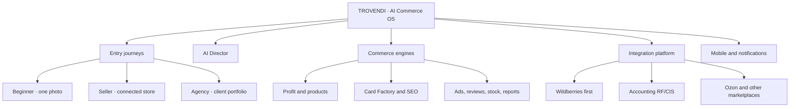
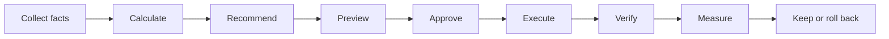

# TROVENDI product tree

Status legend: **live foundation** = real data/code exists; **active** = current production work; **planned** = sequenced but not implemented.

## 1. Entry journeys

- **Beginner — live foundation:** photo analysis → confirmed facts → card draft → economics → preview → approved publication → hand-off to AI Director. Trial: 72 hours from first successful analysis, five successful cards, one user, one store.
- **Existing seller — live foundation:** connect store → catalog/stocks/sales snapshots → products → Card Factory. Profit reconciliation and recommendation queue are next.
- **Agency — planned:** organizations → clients → stores → roles → approvals → portfolio reporting → white label.

## 2. Core operating loop

AI coordinates the loop. Deterministic services remain authoritative for facts, money, permissions, limits, audit and external writes.

## 3. Module branches

| Branch | Status | Depends on | Next gate |
| --- | --- | --- | --- |
| Accounts, stores, trial | **live foundation** | PostgreSQL, auth | Complete RBAC and billing transition |
| WB snapshots | **live foundation** | encrypted token, worker | Reconciliation and freshness SLO |
| Products | **live foundation** | catalog + stock + velocity | Provenance and cross-source identity |
| AI Card Factory | **live foundation** | facts + AI persistence | Production observation of text and media writes |
| Beginner Studio | **active** | trial + facts + Card Factory | Reuse stored visuals and publication pipeline |
| Profit Center | **active** | WB financial ledger + confirmed COGS | Ads, tax and source reconciliation for final profit |
| AI Director | **planned P1** | healthy sources + Profit Center | Evidence-ranked recommendation queue |
| SEO, advertising, reviews | **planned P1** | Director + marketplace readers | Read-only insight before writes |
| Reports and autopilot | **planned P1/P2** | audit + approvals + measurement | Bounded policies and rollback evidence |
| Integration Hub | **planned P2** | canonical commerce model | 1C and MoySklad first |
| Android/PWA | **foundation** | versioned API + event model | Alerts, camera, approve/reject, emergency stop |

## 4. Integration tree

- Marketplaces
  - Wildberries: catalog → stocks → sales velocity → confirmed content text → verified append-only media → economics → ads/reviews/claims.
  - Ozon: begins after the complete WB write path is production-safe.
  - Yandex Market, Megamarket and others: use the same canonical model and connector contract.
- Accounting RF/CIS
  - Wave 1: 1C, MoySklad, Saby/SBIS, Kontur.
  - Wave 2: BAS/localized 1C, Odoo, demand-led enterprise systems.
  - Universal: CSV/XLSX mappings, REST/webhooks, SFTP/object storage and partner SDK.
- Notifications
  - Web Push/PWA first.
  - Android: approval required, stock risk, sync failure, margin risk, advertising limits, reviews and completed AI jobs.

## 5. Delivery spine

1. **P0:** finish one safe WB vertical: facts → generation → storage → approval → write → verification → profit → billing.
2. **P1:** operational AI Director, health monitoring, approval inbox and read-only risk modules.
3. **P2:** Integration Hub, 1C/MoySklad, Ozon, Android and agency roles.
4. **P3:** CIS breadth, connector SDK, more marketplaces and enterprise scale.

This file is the hierarchy view. [`PRODUCT_ROADMAP.md`](./PRODUCT_ROADMAP.md) remains the delivery source of truth.
