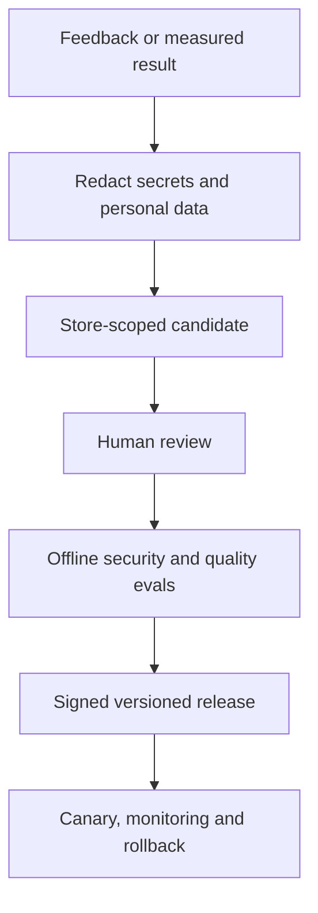

# TROVENDI security model

Status: **mandatory product gate**. Security has priority over autonomy, speed and convenience.

## 1. Authority model

- The customer owner is the highest business authority inside their workspace and stores.
- `AI Director` is the only planning coordinator. It delegates typed tasks but cannot create capabilities.
- Specialist agents can use only the capabilities declared in the versioned registry.
- `Security Sentinel` is independent and deny-only. Its veto cannot be overridden by Director, a model, a prompt, store approval or a marketplace response.
- Platform administrators operate the service but do not silently become store actors. Exceptional support access must be time-bound, justified and audited before it is implemented.
- Global STOP blocks every executor. Resume requires explicit confirmation and a fresh permission check.

## 2. Agent execution gate

An agent response is untrusted data until it passes all gates:

`authenticated actor -> tenant scope -> typed capability -> evidence freshness -> deterministic policy -> Security Sentinel -> approval -> idempotent executor -> post-write verification -> audit`

Current registry policy is deny-by-default. External writes, arbitrary SQL, runtime self-modification and training on raw customer data are disabled.

Owner/admin work orders are routed from an enumerated goal type to one declared agent capability. The instruction is redacted, content-hashed, tenant-scoped and stored with the exact policy version; duplicate submission returns the original work order. Registry version 1 records a plan only and cannot execute the task externally.

Every future executor must declare:

- exact input and output schema versions;
- actor role and store scope;
- allowlisted provider endpoint and HTTP method;
- data provenance and maximum source age;
- risk class, financial limit and confirmation requirement;
- idempotency key, timeout, retry and duplicate policy;
- expected diff, verification query and rollback behavior;
- immutable audit fields and redaction policy.

Approval authorizes one reviewed intent; it does not authorize a different payload after source data changes. The executor must revalidate the target, facts and limits immediately before the write.

## 3. Learning without uncontrolled self-modification

TROVENDI agents do not rewrite their own code, tools, system policy or production prompts.

- Feedback is idempotent and stores a content hash.
- Candidate approval does not change agent behavior.
- Promotion requires a separate evaluation artefact and versioned release.
- Financial facts, permissions and inventory never become vector-memory truth.
- Tenant data remains tenant-scoped. Cross-customer learning requires separate consent, contractual permission, cohort protection and privacy review.
- Unsafe feedback is evidence for investigation, never a direct instruction to the agent.

## 4. AI-specific threat controls

| Threat | Required control |
| --- | --- |
| Prompt injection in product text, reviews, documents or images | Mark external content untrusted; extract facts into schemas; never treat retrieved text as an instruction |
| Tool or connector poisoning | Signed/versioned connector contract, hostname and method allowlist, response validation and least-privilege credentials |
| Cross-tenant disclosure | Store/workspace scope on every query and object key; negative isolation tests; no shared retrieval namespace |
| Secret exfiltration | Encrypt credentials, never include them in prompts or browser responses, redact logs and learning candidates |
| Hallucinated financial or product facts | Deterministic calculation and immutable fact sets; unknown remains unknown; provenance shown to the user |
| Cost denial / runaway loops | Per-workspace budgets, step/time ceilings, deduplication, queue backpressure and global STOP |
| Replay or duplicate external write | Idempotency key, locked execution record, provider verification and no blind automatic retry |
| Model or prompt regression | Version pinning, eval gates, canary release, measurable rollback and audit |

## 5. Application and infrastructure baseline

- Authentication sessions use `HttpOnly`, `Secure` in production and `SameSite=Lax` cookies.
- Marketplace and accounting credentials are encrypted at rest and are never returned after entry.
- Authorization is performed server-side on every store-scoped request; a client-supplied `store_id` is never trusted alone.
- Database migrations, backups and point-in-time recovery are tested. Restore tests matter more than the existence of a backup setting.
- Background jobs are durable, idempotent, observable and bounded by per-token provider rate limits.
- Production uses dependency and secret scanning, protected branches, reviewed migrations and environment separation.
- Logs and audit avoid raw credentials, payment details, personal documents and unnecessary marketplace payloads.
- Security events have owner-visible severity, affected scope, containment state and a documented response path.

## 6. Release gates

Before any agent receives a new write capability:

1. Threat model and data-flow review are updated.
2. Tenant-isolation, permission, injection, replay and failure-path tests pass.
3. The exact request diff is shown before confirmation.
4. Idempotency and post-write verification pass against a sandbox or controlled store.
5. STOP and provider-side revocation are verified.
6. Audit reconstruction answers who, what, store, evidence, policy version, payload hash and result.
7. A bounded rollout and rollback owner are named.

No feature is labelled autonomous, secure or learning merely because a prompt says so.
