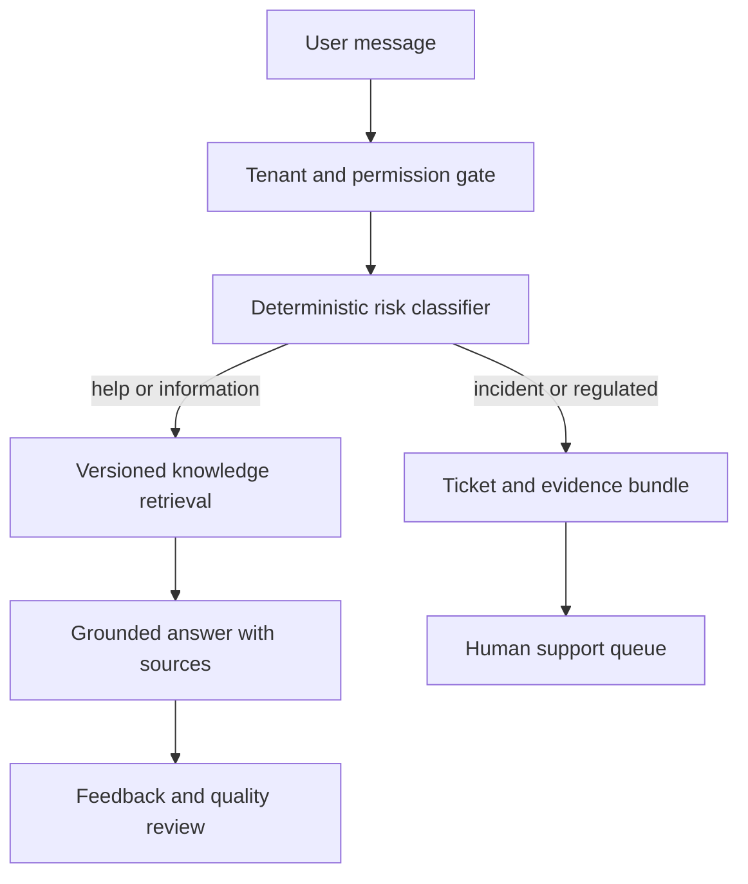

# TROVENDI AI Support Agent

Status: **accepted P1 safety capability; implementation not started**.

The Support Agent is an in-product assistant for product guidance, current marketplace information and incident intake. It is not the same agent as Daily AI Director and cannot inherit Director execution permissions.

## 1. Product scope

The agent handles four routes:

1. `product_help` — how TROVENDI works, navigation, settings and metric explanations.
2. `marketplace_information` — current marketplace requirements from approved, versioned sources.
3. `incident` — sync, publication, calculation or approved-action failure.
4. `legal_or_billing` — contract, refund, personal data, tax or legal questions requiring a human route.

Artificial purchases, review manipulation, ranking abuse and other prohibited practices are outside scope. The agent refuses operational instructions for them and may link to compliant alternatives.

## 2. Non-negotiable safety rules

- Support has read-only access to the minimum tenant-scoped evidence required for the conversation.
- It cannot publish content, change prices, alter bids, move stock, issue refunds or resume automation.
- A store owner may use a separate authenticated emergency STOP control from the incident flow. The support model never bypasses permissions or confirmation.
- Suspected financial loss, unexpected external write, tenant/security issue, personal-data issue, refund dispute or legal question always creates or updates a human-review ticket.
- The UI never invents a response deadline. It displays a configured support policy and current queue target only when operations have actually configured them.
- Secrets, access tokens, full payment details and unrelated tenant data are excluded from prompts, retrieval and tickets.
- A generated answer is not a marketplace, legal, tax or accounting source of truth.

## 3. Architecture

The deterministic classifier runs before generation. High-risk keywords and system signals force escalation; an LLM classifier may add labels but cannot downgrade a forced escalation.

Suggested services:

- `support-api`: conversations, messages, permissions and ticket lifecycle.
- `knowledge-ingestion`: fetch, validate, version, expire and index approved documents.
- `support-retrieval`: tenant-filtered hybrid lexical/vector search with reranking.
- `incident-evidence`: collect bounded audit and health facts by correlation ID.
- `support-worker`: asynchronous ingestion, ticket enrichment and notifications.

## 4. Knowledge base and RAG

Knowledge collections:

- TROVENDI product documentation and release notes.
- Marketplace rules from official or contractually approved sources.
- Approved operational runbooks.
- Curated, de-identified incident resolutions.
- Beginner onboarding and verified FAQs.

Every document and chunk stores:

- source URL or internal document ID;
- publisher and source type;
- marketplace, country, module and audience;
- effective, retrieved, reviewed and expiry timestamps;
- product/version applicability;
- approval state and reviewer;
- checksum and superseded version;
- tenant scope: global, organization or store.

Only approved, non-expired versions can support a definitive answer. The response shows citations and an `updated at` value. Conflicting or missing evidence produces a qualified answer or escalation, never a confident completion.

Generated placeholders may be used as documentation templates but remain `draft` and are never retrieved as factual guidance.

## 5. Incident flow

1. Authenticate user and resolve organization/store context.
2. Classify severity and forced-escalation reason.
3. Ask only for missing reproduction details; do not make the user repeat facts already in system evidence.
4. Offer the authorized owner an emergency STOP when continued execution may increase loss.
5. Create the ticket transactionally before promising that it exists.
6. Attach a redacted evidence bundle and show the ticket ID/status.
7. Notify the configured human queue and preserve every status transition.

### Evidence bundle

- organization, store, marketplace and affected SKU/campaign IDs;
- actor and role, conversation ID and user description;
- timestamps, timezone, severity and financial-impact estimate labelled as reported or calculated;
- Director recommendation/decision/execution IDs;
- external write request hash, idempotency key, provider response and verification state;
- audit events and relevant source freshness before/after the incident;
- jobs, correlation/request IDs and redacted error details;
- current STOP state and whether the owner changed it;
- attachments scanned and access-controlled.

The default evidence window is selected by incident type, not hard-coded to 24 hours. It includes the causal operation and may extend far enough to establish the baseline.

## 6. Core schema

- `support_conversations`, `support_messages`, `support_message_citations`.
- `support_classifications`, `support_escalation_rules`, `support_policy_versions`.
- `knowledge_documents`, `knowledge_document_versions`, `knowledge_chunks`.
- `knowledge_reviews`, `knowledge_ingestion_runs`, `knowledge_source_health`.
- `support_tickets`, `support_ticket_events`, `support_ticket_links`.
- `incident_evidence_bundles`, `incident_evidence_items`, `support_attachments`.
- `support_feedback`, `support_quality_reviews`, `support_evaluation_runs`.

All records are organization-scoped where applicable. Global knowledge is explicitly marked and contains no customer data.

## 7. Learning and quality loop

New conversations do not automatically train the model or become shared knowledge.

1. Resolve the incident with a human-authored outcome.
2. Remove secrets and personal/customer identifiers.
3. Convert the reusable lesson into a reviewed runbook or FAQ version.
4. Run retrieval and response evaluations against regression cases.
5. Approve and publish the new knowledge version.
6. Measure containment, escalation precision, unsupported claims, citation quality and repeat-contact rate.

Financial and security incidents are sampled for human quality review even when routing was correct.

## 8. MVP sequence

### P1A — incident intake first

- Chat entry point with store context.
- Forced-escalation rules and severity.
- Ticket creation, evidence bundle and owner-only emergency STOP link.
- Human queue status; no invented SLA.

### P1B — TROVENDI product help

- Versioned product documentation ingestion.
- Grounded answers with citations and feedback.
- Beginner onboarding questions.

### P1C — marketplace information

- Approved WB sources first, source-health monitoring and expiry.
- Ozon and other marketplaces only after source contracts and update cadence are verified.

### Later

- Suggested replies for human agents.
- Curated incident runbooks and proactive incident notices.
- Multilingual support and channel expansion.

## 9. Release gates

- Cross-tenant retrieval and IDOR tests pass.
- Every forced-escalation case creates exactly one idempotent ticket.
- The model cannot downgrade incident, legal, billing or security escalation.
- Citation correctness, document expiry and conflicting-source behavior are tested.
- Secret/PII redaction is tested before model calls and ticket display.
- STOP remains a separate authenticated control with audit evidence.
- Support claims match implemented TROVENDI capabilities; planned autopilot is never described as live.

